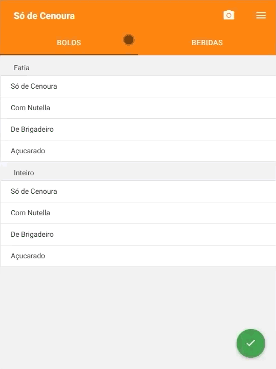

# App Criado com Cordova para Android: Só Cenoura

Projeto criado em Cordova de um app de pedidos para uso interno no restaurante.

<br>

<div align="center">
  

</div>

<br>

## Tecnologias utilizadas
Tecnologia | Descrição | Versão | Site
------------ | ------------- | ------------ | ------------
Cordova | Mobile apps with HTML, CSS & JS | 3.0.0 | https://cordova.apache.org
Cordova Plugin Statusbar  | Statusbar | 0.3.2 | https://www.npmjs.com/package/cordova-plugin-statusbar
Phonegap Plugin Barcodescanner  | Scanner QR Code | 0.3.2 | https://www.npmjs.com/package/phonegap-plugin-barcodescanner
Materialize | Framework baseado no Material Design da Google | 4.11.0 | https://materializecss.com/

<br>

## Demo

cordova-phonegap.netlify.com/

<!--
## Project setup
```
yarn install
```
<!--
### Compiles and hot-reloads for development
```
yarn serve
```
<!--
### Compiles and minifies for production
```
yarn build
```
<!--
### Customize configuration
See [Configuration Reference](https://cli.vuejs.org/config/).


